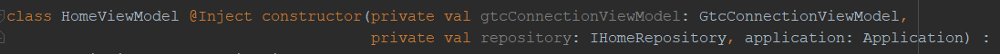

# ViewModel Composition

A single activity should bind to a single ViewModel. Common functionality can be extracted to a composable ViewModel(s) which can be reused. In this example HomeViewModel injects GtcConnectionViewModel in the constructor:

As many as needed ViewModels can be injected for composition. Dagger uses the custom factory (ViewModelProviderFactory) to inject an instance. The instantiated ViewModel(s) is (are) not managed by Android and should receive the onCleared() method call manually from the ViewModel which injected them (in this case HomeViewModel):

 invokation")

You will notice that the composed ViewModel's (GtcConnectionViewModel) onCleared() method is not available because it is protected. The method should be defined public (inside the composed GtcConnectionViewModel):

")

The composed ViewModel exposes _input_ and _output_ of each of the contained View Model. The View consumes them by directly binding its View Binding to their Inputs/Outputs using RxBindings.
[Read More about using RxBindings](Documentation/DataBinding.md)
