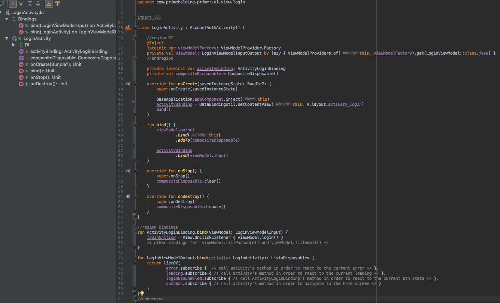
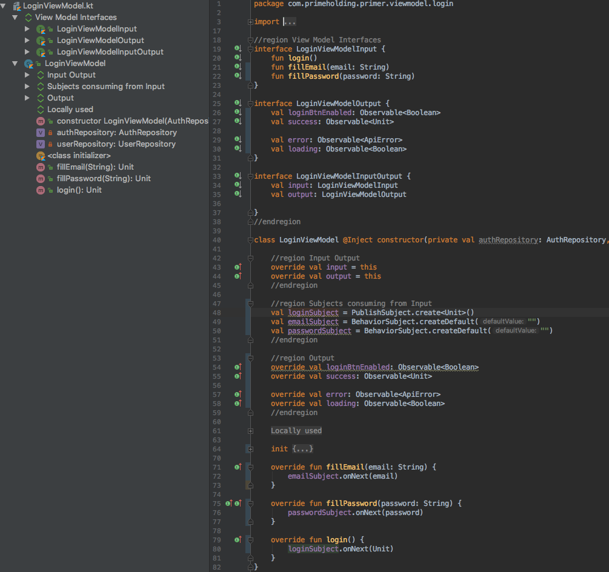
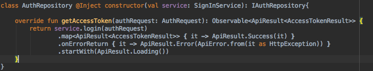

# MVVM - Model, View, ViewModel
> The Model-View-ViewModel (MVVM) pattern helps to cleanly separate the business and presentation logic of an application from its user interface (UI). Maintaining a clean separation between application logic and the UI helps to address numerous development issues and can make an application easier to test, maintain, and evolve. It can also greatly improve code re-use opportunities and allows developers and UI designers to more easily collaborate when developing their respective parts of an app

## Diagram flow
1. Activity/Fragment pushes events to the ViewModel's inputs
2. The ViewModel transforms above events in a way that Repository will understand
3. Repository retrieves data from any data source
3a. Local DB
3b. Web Service
3c. Cache etc.
4. The Repository delivers data via Observables to the ViewModel
5. Activity/Fragment observes ViewModel's outputs via data binding

## Activity/Fragment
An Activity or Fragment, with their layout, represents the **view layer**. The view role in this pattern is to
*  Defining the structure, layout, and appearance of what the user sees on screen
* Observe (or subscribe to) a **ViewModel** outputs (observables) to get data in order to update UI elements accordingly
* Delegate user actions to a **ViewModel** via ViewModel's inputs (methods)

## ViewModel
The view model is an abstraction of the view exposing **outputs** (observables) and **inputs** (methods). Each ViewModel should encapsulate the business logic in a way that it could be reused across the entire app.ViewModelInputOutput
Following rules have to be considered when a ViewModel is being implemented:
* It should never reference a view
* It should encapsulate a specific logic.
* If some screen is complex in terms of UI Elements/Panels it should be implemented as much ViewModels as needed as they have to be wrapped in a single ViewModel via composition/DI (see below). Then that single view model should be instantiated in the Activity/Fragment with Dependency Injection (for example Dagger)
* The view model should not cointain state in the best case scenario, even though Stateful ViewModels are acceptable in case the models/collection should be locally manipulated
*Example: sorting/filtering/adding/removing items from a collection etc.*
* It's unit testable
* All outputs have to be initialized inside init body
* For better readability **custom operators** have to be implemented to serve specific Observable needs

### Inputs
*  ViewModelInput is an interface that groups all inputs (methods) that the ViewModel should implement
*  For each input (method) should be declared a Publish|Behaviour Subject so that internaly observables will be used while only the method will be exposed to the ViewModel consumer.

### Outputs
* ViewModelOutput is an interface that groups all outputs (observables) that the ViewModel should implement
* Each output is represented as a Observable of presentable data (ViewState) that the consumer will use in order to update UI elements accordingly

### ViewModelInputOutput
ViewModelInputOutput composes **Input** and **Output**.
Activity/Fragment knows only for ViewModelInputOutput and the ViewModel itself is hidden from it, so the only way of accessing Inputs/Outputs is the following:
 * vieModel.input.*
 * viewModel.output.*

The above setup improves readability and allows implementing **bindings** for output streams
## Bindings
In order to glue View (Activity/Fragment) with a ViewModels a ViewModelOutput extensions function should be implemented

### View Data Bindings
Where possible, the View Model's Input/Output should be directly connected to the View Binding via extension function. [ RxBinding](https://github.com/JakeWharton/RxBinding) is an extremely helpful tool for that purpose.

[Read More](Documentation/RxBindings.md)

## ViewModel Composition

If a screen has a variety of functionalities, or one complex functionality, it should be split up into separate View Models that can be easily **reused**.
For more information, refer to [ViewModel Composition](./Documentation/ViewModelComposition.md).

## Repository
The repository pattern is a design pattern that isolates data access behind interface abstractions. Connecting to the database, Cache, Web Service and manipulating data storage objects is performed through methods provided by the interface's implementation.
Each Repository contains methods that returns Observables. The idea behind is that when the ViewModel asks for some data the Repository will retrieve from any data source and will provide it in timely manner but not immediately, therefore all repository's methods should return **Observable**

